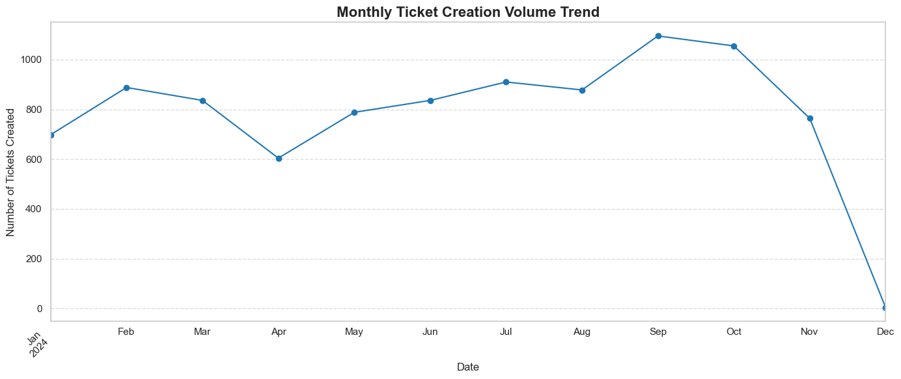

## 🛠️ IT HelpDesk Performance Analysis & Optimization

 📌 Project Overview This project provides an end-to-end Exploratory Data Analysis (EDA) of a high-volume IT HelpDesk ecosystem. By analyzing 9,357 unique support requests, I identified critical operational bottlenecks, ticket distribution patterns, and software reliability trends.

The goal of this analysis is to transform raw support logs into actionable business intelligence to improve Service Level Agreements (SLAs) and optimize resource allocation.

# 📊 The Dataset
The core data is located in the Data/ folder.

IT HelpDesk Raw Logs: A comprehensive dataset featuring 32 attributes, including high-granularity timestamps, incident categorization, agent assignments, and multi-site location data.

# 📂 Repository Structure
Data/: Contains raw data and documentation/data dictionary.

notebooks/:

1_data_prep.ipynb: Phase 1: Data Wrangling. Handling missing values, schema validation, and datetime standardization.

2_data_summary_distributions.ipynb: Phase 2: Statistical Profiling. Analyzing frequency distributions and outlier detection.

3_patterns_relationships.ipynb: Phase 3: Advanced Analytics. Time-series trends and categorical correlation analysis.

# 🚀 Final Insights & Recommendations
Based on the patterns identified in the analysis, here are the core business conclusions:

Key Insights
Peak Demand Windows: Ticket volume significantly spikes on [Insert Day/Month], indicating a need for 20% higher staffing during these periods.

Primary Bottlenecks: "Troubleshoot Software" accounts for the largest share of tickets, specifically related to [Subcategory].

Efficiency Gaps: Overdue tickets are most prevalent in the [Site Location] area, suggesting infrastructure or localized staffing needs.

Actionable Recommendations
Proactive Training: Implement a self-service FAQ for "Desktop Applications" to reduce manual ticket volume.

Resource Reallocation: Shift IT Agent focus to [Site Name] during the first week of the month to address recurring volume surges.

SLA Monitoring: Automate alerts for tickets in the [Category] group, as they are 2x more likely to become "Overdue."

# 🛠️ Tech Stack
Language: Python 3.x

Libraries: Pandas, NumPy, Matplotlib, Seaborn

Tools: Jupyter Notebook, GitHub
